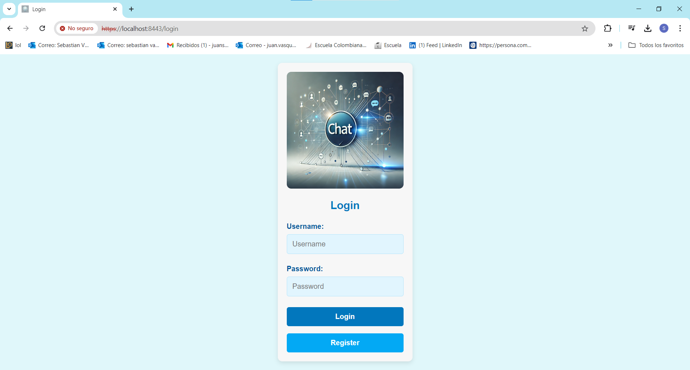
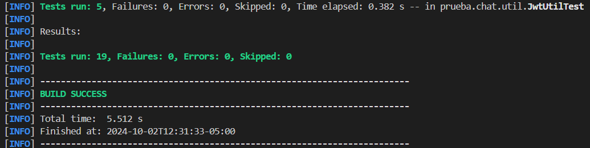
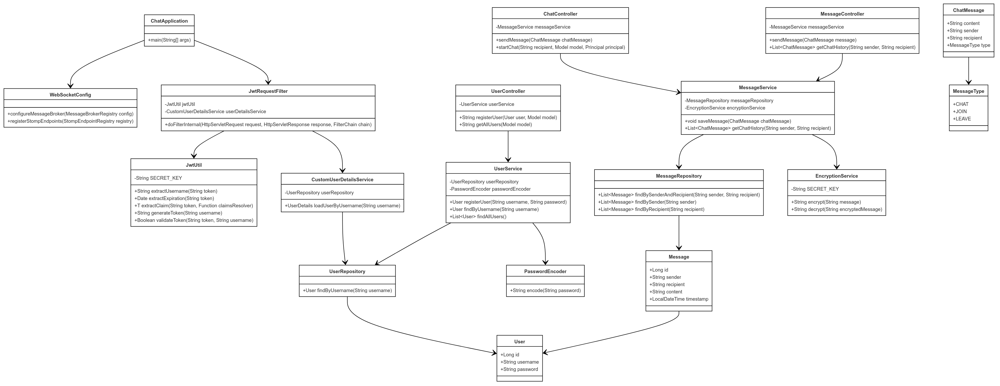
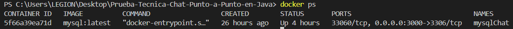

# Chat Application with Spring Boot

This project implements a real-time chat system using Spring Boot, WebSockets, and STOMP. It allows users to send encrypted messages and manage chat rooms. The system includes a web interface for user interaction and integrates JWT-based authentication for secure access.

## Getting Started

These instructions will help you get a copy of the project up and running on your local machine for development and testing purposes.

### Prerequisites

You need to install the following tools and configure their dependencies:

1. **Java** (versions 11 or higher)
    ```sh
    java -version
    ```
    Should return something like:
    ```sh
    java version "21.0.4" 2024-07-16 LTS
    Java(TM) SE Runtime Environment (build 21.0.4+8-LTS-274)
    Java HotSpot(TM) 64-Bit Server VM (build 21.0.4+8-LTS-274, mixed mode, sharing)
    ```

2. **Maven**
    - Download Maven from [here](http://maven.apache.org/download.html)
    - Follow the installation instructions [here](http://maven.apache.org/download.html#Installation)

    Verify the installation:
    ```sh
    mvn -version
    ```
    Should return something like:
    ```sh
    Apache Maven 3.9.9 (8e8579a9e76f7d015ee5ec7bfcdc97d260186937)
    Maven home: C:\workspace\apache-maven-3.9.9
    Java version: 21.0.4, vendor: Oracle Corporation, runtime: C:\Program Files\Java\jdk-21
    Default locale: es_CO, platform encoding: UTF-8
    OS name: "windows 10", version: "10.0", arch: "amd64", family: "windows"
    ```

3. **Git**
    - Install Git by following the instructions [here](http://git-scm.com/book/en/v2/Getting-Started-Installing-Git)

    Verify the installation:
    ```sh
    git --version
    ```
    Should return something like:
    ```sh
    git version 2.45.1.windows.1
    ```

## Installing

1. Clone the repository and navigate into the project directory:
    ```sh
    git clone https://github.com/Sebasvasquezz/Prueba-Tecnica-Chat-Punto-a-Punto-en-Java.git

    cd Prueba-Tecnica-Chat-Punto-a-Punto-en-Java
    ```

2. Build the project:
    ```sh
    mvn package
    ```

    This should generate a JAR file in the `target` directory.

3. Execute the docker compose file to initialize the database:
    ```sh
    docker-compose up -d
    ```
4. Run the application:
    ```sh
    java -jar target/chat-0.0.1-SNAPSHOT.jar
    ```

    The application will start, and you can access the web interface at `https://localhost:8443/`.
    
    

    **For more details check the video:
    execution.mp4 in the images folder:
    Prueba-Tecnica-Chat-Punto-a-Punto-en-Java\images\execution.mp4**

## Project Structure

### Key Features

- **Real-time messaging**: Send and receive messages instantly using WebSockets and STOMP.
- **JWT-based authentication**: Secure login and access control using JSON Web Tokens.
- **Encryption**: Messages are encrypted before being sent using AES encryption.
- **User management**: Registration and login system for users.

## Components

1. **MessageController**: Handles sending and receiving messages via WebSocket endpoints.
2. **UserController**: Manages user registration and login functionality.
3. **JwtRequestFilter**: Intercepts requests to validate JWT tokens for secure access.
4. **EncryptionService**: Provides AES encryption and decryption services for message security.
5. **CustomUserDetailsService**: Loads user details for Spring Security authentication.

## API Endpoints

The application provides the following RESTful API endpoints:

| Method   | Endpoint            | Description                    |
|----------|---------------------|--------------------------------|
| POST     | `/authenticate/login`| Login and generate a JWT token |
| POST     | `/users/register`    | Register a new user            |


## WebSocket Endpoints

- **`/chat-websocket`**: Main WebSocket endpoint for connecting to the chat.
- **`/app/chat.sendMessage`**: Used to send a message.
- **`/topic/public`**: Broadcasts messages to all connected clients.

## Usage

#### 1. Real-time Chat

- **How to use it:** Users can log in, select a recipient, and start chatting in real time.
- **Expected behavior:** Messages are encrypted and sent to the server, then broadcast to the recipient.

## Tests
Run the tests with the command:

```sh
mvn test
```
Result:


## Architectural Diagram


This project is a **real-time chat application** built using **Spring Boot** and **WebSockets**. It includes **JWT-based authentication** and **AES encryption** for secure messaging between users. The system is divided into several components, each playing a specific role in the architecture.

### Components

#### 1. **Frontend**
- **Thymeleaf Templates**: Handles the dynamic HTML generation for the chat interface.
- **HTML/CSS/JS**: Static resources used to render the user interface in the browser.

#### 2. **Backend**
- **ChatApplication**: The entry point of the Spring Boot application. It configures and starts the application.
  
- **WebSocketConfig**: Configures WebSocket endpoints for real-time communication between users.
  
- **JwtRequestFilter**: Filters incoming HTTP requests and validates JWT tokens to ensure secure access to resources.
  
##### **Controllers**
- **ChatController**: Manages WebSocket-based messaging and handles real-time chat events.
- **MessageController**: Handles HTTP requests for message-related operations (e.g., retrieving message history).
- **UserController**: Manages user registration and authentication-related operations.

##### **Services**
- **MessageService**: Contains business logic for saving and retrieving chat messages from the database.
- **UserService**: Manages user-related operations such as registration, user lookup, and password encryption.
- **EncryptionService**: Provides AES encryption and decryption functionalities to ensure secure messaging.
- **CustomUserDetailsService**: Loads user-specific data for authentication purposes within Spring Security.

##### **Repositories**
- **MessageRepository**: A data access layer for the `Message` entity. It allows for querying messages between users.
- **UserRepository**: Handles CRUD operations for `User` entities, providing access to user data from the database.

##### **Utilities**
- **JwtUtil**: A utility class for generating, parsing, and validating JWT tokens used for authentication.

#### 3. **Database**
- **MySQL**: The relational database used for storing user and message data.

#### 4. **Security**
- **JWT Token**: Used to authenticate users and manage their sessions securely without maintaining server-side sessions.
- **PasswordEncoder**: Handles password encryption to ensure user credentials are securely stored.

### Flow of Communication

1. The user interacts with the **frontend**, where the chat interface is rendered using Thymeleaf and static resources (HTML/CSS/JS).
   
2. When the user sends a message, it is encrypted using the **EncryptionService** and sent to the backend via WebSocket.

3. **ChatController** handles WebSocket communication and processes the message. The message is saved in the **MySQL** database using **MessageService** and **MessageRepository**.

4. To retrieve message history, the **MessageController** interacts with **MessageService** to fetch encrypted messages from **MessageRepository**, decrypts them, and sends them back to the frontend.

5. For authentication, users log in using a JWT-based system. The **UserController** processes login requests and generates a JWT token using **JwtUtil**. This token is validated by the **JwtRequestFilter** on each subsequent request.

### Technologies Used

- **Spring Boot**: Backend framework for creating a REST API and handling WebSocket communication.
- **WebSocket + STOMP**: For real-time communication between users.
- **Thymeleaf**: Template engine for rendering the chat interface.
- **JWT (JSON Web Tokens)**: For secure authentication and session management.
- **AES Encryption**: For secure message transmission between users.
- **MySQL**: Database for storing user information and chat messages.

## Class Diagram



The class diagram represents the key components of the chat application and their interactions:

### Classes and Components

#### 1. **ChatApplication**
- Entry point for the Spring Boot application.
- Method: 
  - `main(String[] args)`: Starts the Spring Boot application.

#### 2. **WebSocketConfig**
- Configures WebSocket messaging endpoints and message broker.
- Methods:
  - `configureMessageBroker(MessageBrokerRegistry config)`: Configures message broker for WebSocket messaging.
  - `registerStompEndpoints(StompEndpointRegistry registry)`: Registers WebSocket STOMP endpoints.

#### 3. **JwtRequestFilter**
- Filters incoming HTTP requests and validates JWT tokens.
- Methods:
  - `doFilterInternal(HttpServletRequest request, HttpServletResponse response, FilterChain chain)`: Processes JWT tokens for incoming requests.

#### 4. **JwtUtil**
- Provides utility methods for generating, validating, and extracting information from JWT tokens.
- Methods:
  - `extractUsername(String token)`: Extracts the username from a JWT token.
  - `extractExpiration(String token)`: Extracts the expiration date from a JWT token.
  - `generateToken(String username)`: Generates a JWT token for a given username.
  - `validateToken(String token, String username)`: Validates a JWT token.

#### 5. **ChatController**
- Handles WebSocket-based messaging between users.
- Methods:
  - `sendMessage(ChatMessage chatMessage)`: Sends a chat message.
  - `startChat(String recipient, Model model, Principal principal)`: Initializes a chat between users.

#### 6. **MessageController**
- Provides HTTP endpoints for message-related operations, such as retrieving chat history.
- Methods:
  - `sendMessage(ChatMessage message)`: Sends a message via HTTP.
  - `getChatHistory(String sender, String recipient)`: Retrieves the chat history between two users.

#### 7. **UserController**
- Manages user registration and retrieval.
- Methods:
  - `registerUser(User user, Model model)`: Registers a new user.
  - `getAllUsers(Model model)`: Retrieves all registered users.

#### 8. **MessageService**
- Business logic related to messages, including saving and retrieving encrypted messages.
- Methods:
  - `saveMessage(ChatMessage chatMessage)`: Saves an encrypted message to the database.
  - `getChatHistory(String sender, String recipient)`: Retrieves chat history between two users.

#### 9. **UserService**
- Handles business logic related to user registration and retrieval.
- Methods:
  - `registerUser(String username, String password)`: Registers a new user with an encrypted password.
  - `findByUsername(String username)`: Finds a user by their username.
  - `findAllUsers()`: Retrieves all users from the database.

#### 10. **EncryptionService**
- Provides AES encryption and decryption services.
- Methods:
  - `encrypt(String message)`: Encrypts a message using AES.
  - `decrypt(String encryptedMessage)`: Decrypts an AES-encrypted message.

#### 11. **CustomUserDetailsService**
- Loads user-specific data for authentication purposes within Spring Security.
- Methods:
  - `loadUserByUsername(String username)`: Loads a user by their username for authentication.

#### 12. **MessageRepository**
- Repository interface for the `Message` entity, used for database interaction.
- Methods:
  - `findBySenderAndRecipient(String sender, String recipient)`: Retrieves messages exchanged between two users.
  - `findBySender(String sender)`: Retrieves messages sent by a specific user.
  - `findByRecipient(String recipient)`: Retrieves messages received by a specific user.

#### 13. **UserRepository**
- Repository interface for the `User` entity, used for user-related database operations.
- Methods:
  - `findByUsername(String username)`: Finds a user by their username.

#### 14. **ChatMessage**
- Represents a chat message exchanged between users in real-time.
- Attributes:
  - `content`: The content of the message.
  - `sender`: The username of the message sender.
  - `recipient`: The username of the message recipient.
  - `type`: The type of the message (CHAT, JOIN, LEAVE).

#### 15. **Message**
- Entity representing a stored message in the database.
- Attributes:
  - `id`: The unique identifier of the message.
  - `sender`: The username of the message sender.
  - `recipient`: The username of the message recipient.
  - `content`: The encrypted content of the message.
  - `timestamp`: The date and time the message was sent.

#### 16. **User**
- Entity representing a user in the system.
- Attributes:
  - `id`: The unique identifier of the user.
  - `username`: The username of the user.
  - `password`: The encrypted password of the user.

#### 17. **PasswordEncoder**
- Utility class used to encode passwords.
- Methods:
  - `encode(String password)`: Encodes a plain-text password.

#### 18. **MessageType**
- Represents the type of chat message.
- Attributes:
  - `CHAT`: A regular chat message.
  - `JOIN`: Indicates that a user has joined a chat.
  - `LEAVE`: Indicates that a user has left a chat.

### Relationships

- **ChatApplication** is connected to **WebSocketConfig** and **JwtRequestFilter**, initializing the configuration and filters.
- **Controllers** (ChatController, MessageController, UserController) depend on their respective services (MessageService, UserService).
- **JwtRequestFilter** depends on **JwtUtil** and **CustomUserDetailsService** for token validation and user authentication.
- **Services** depend on **Repositories** for database operations and **EncryptionService** for message encryption/decryption.
- **Entities** (Message, User) are linked to their corresponding repositories for persistence.

This class diagram provides a detailed overview of how the components in the project interact with each other, following the MVC (Model-View-Controller) architecture.


### Docker Compose Configuration

The following `docker-compose.yml` file configures the instance and properties of MySQL data base:

```yaml
services:
  mysql:
    container_name: 'mysqlChat'
    image: 'mysql:latest'
    environment:
      - 'MYSQL_DATABASE=mydatabaseChat'
      - 'MYSQL_PASSWORD=secret'
      - 'MYSQL_ROOT_PASSWORD=verysecret'
      - 'MYSQL_USER=myuser'
    ports:
      - '3000:3306'
```
### Verifying Execution

To verify that all containers are running correctly on the virtual machine, the following command was used:

```sh
docker ps
```



## Built With

* [Maven](https://maven.apache.org/) - Dependency Management
* [Git](http://git-scm.com/) - Version Control System
* [Docker](https://www.docker.com) - Containerization and deployment.
* [MySQL](https://www.mysql.com/) - MySQL database. 

## Versioning

I use [GitHub](https://github.com/) for versioning. For the versions available, see the [tags on this repository](https://github.com/Sebasvasquezz/Prueba-Tecnica-Chat-Punto-a-Punto-en-Java.git).

## Authors

* **Juan Sebastian Vasquez Vega**  - [Sebasvasquezz](https://github.com/Sebasvasquezz)

## Date

October 2, 2024

## License

This project is licensed under the GNU License - see the [LICENSE.txt](LICENSE.txt) file for details.
